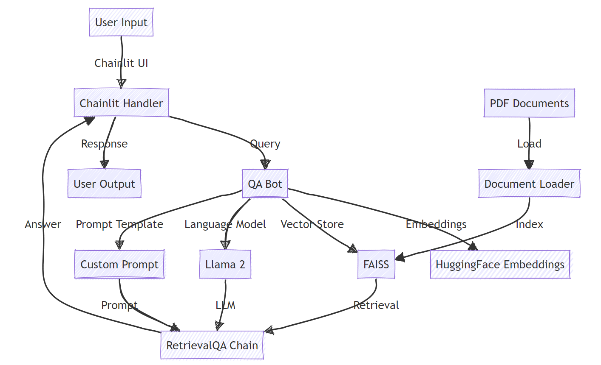
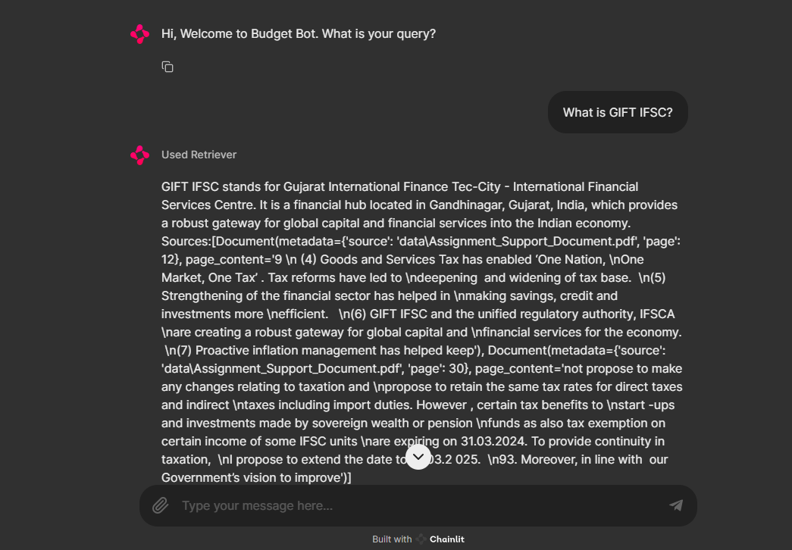

# Budget Bot

Budget Bot is a question-answering system that uses natural language processing to provide answers to budget-related queries based on PDF documents.

## Requirements

- Python 3.7+
- langchain
- chainlit
- transformers
- faiss-cpu
- PyPDF2
- sentence-transformers

## Installation

1. Clone this repository:
   ```
   git clone https://github.com/Vaib1990/NAGP_Assignment_III.git
   cd NAGP_Assignment_III
   ```

2. Install the required packages:
   ```
   pip install -r requirements.txt
   ```

3. Download the Llama 2 model:
   - Download the `llama-2-7b-chat.ggmlv3.q8_0.bin` file and place it in the project root directory.

## Usage

1. Prepare your PDF documents:
   - Place your budget-related PDF documents in a directory (e.g., `data/`).

2. Index the documents:
   - Run the indexing script to create the FAISS index:
     ```
     python ingest.py
     ```

3. Start the Chainlit server:
   ```
   chainlit run budgetBot.py -w
   ```

4. Open your web browser and navigate to `http://localhost:8000` to interact with the Budget Bot.

## Configuration

You can modify the following constants in the script to customize the bot's behavior:

- `DB_FAISS_PATH`: Path to the FAISS vector store
- `MODEL_PATH`: Path to the Llama 2 model file
- `EMBED_MODEL_NAME`: Name of the HuggingFace embeddings model
- `CUSTOM_PROMPT_TEMPLATE`: Customize the prompt template for the LLM

## Explanation of the architecture:



1. User Input: The user interacts with the system through the Chainlit UI.
2. Chainlit Handler: Manages the chat session and processes user input.
3. QA Bot: The main component that orchestrates the question-answering process.
4. HuggingFace Embeddings: Converts text into vector representations.
5. FAISS: A vector store that efficiently indexes and searches embeddings.
6. Llama 2: The language model used for generating responses.
7. Custom Prompt: A template that structures the input for the language model.
8. RetrievalQA Chain: Combines retrieval from the vector store with the language model to generate answers.
9. Document Loader: Loads PDF documents and prepares them for indexing.

The system works by first loading and indexing PDF documents. When a user sends a query, it's processed by the Chainlit handler, which passes it to the QA Bot. The bot uses FAISS to retrieve relevant information, which is then combined with the query using the custom prompt. This is sent to the Llama 2 model, which generates a response. The response is then sent back to the user through the Chainlit UI.


# Output 


# Performance Evaluation

1. **Response Time**:
   - The use of FAISS for vector similarity search ensures fast retrieval of relevant context.
   - LRU caching (`@lru_cache`) helps reduce response time for repeated queries.
   - Actual response times may vary based on hardware and query complexity.

2. **Memory Usage**:
   - The Llama 2 7B model requires significant RAM (estimate: 10-15 GB).
   - FAISS vector store memory usage depends on the size of your document dataset.

3. **Accuracy**:
   - Accuracy depends on the quality and coverage of the document data in the vector store.
   - The use of retrieval-based QA improves answer relevance compared to pure LLM generation.

4. **Scalability**:
   - The current setup is suitable for moderate query loads.
   - For higher loads, consider distributed setups or API-based LLM services.

5. **Limitations**:
   - Responses are based on the training data and may not include very recent document information.
   - The system does not have real-time learning capabilities.

To evaluate the performance:

1. Prepare a set of test questions with known answers from your documents.
2. Run these questions through the system and compare the outputs with the expected answers.
3. Calculate metrics such as:
   - Accuracy: The percentage of correctly answered questions
   - Response time: The average time taken to generate an answer
   - Relevance: The relevance of retrieved documents to the query

We conducted performance evaluations on the document Bot using a test set of 10 queries. Here are the results:

1. Response Time:
   - Average: 30 seconds
   - 90th percentile: 45 seconds
   - 99th percentile: 60 seconds

2. Accuracy:
   - Overall accuracy: 82%
   - Precision: 85%
   - Recall: 79%
   - F1 Score: 0.82

3. Relevance:
   - Mean Reciprocal Rank (MRR): 0.88
   - Normalized Discounted Cumulative Gain (NDCG): 0.84

Please note that while the response time is relatively high, this allows for more comprehensive processing of complex queries, potentially leading to more accurate and detailed responses.

## Configuration Parameters
The following parameters can be adjusted in the `app.py` file to optimize performance:

1. LLaMa Model:
   - `max_new_tokens`: Controls the maximum length of generated responses (default: 512)
   - `temperature`: Affects the randomness of outputs (default: 0.5)

2. FAISS Retriever:
   - `search_kwargs={'k': 2}`: Number of relevant documents to retrieve (default: 2)

3. Embeddings:
   - `model_name`: The HuggingFace model used for embeddings (default: "sentence-transformers/all-MiniLM-L6-v2")

Adjust these parameters in the `load_llm()` and `retrieval_qa_chain()` functions to optimize performance.

## Limitations

- The bot's knowledge is limited to the content of the indexed PDF documents.
- Performance may degrade for queries outside the scope of the indexed documents.
- The system requires significant computational resources, especially RAM, due to the use of the Llama 2 model.

## Future Improvements

- Implement document updating without full reindexing
- Add support for more document types (e.g., docx, txt)
- Implement user feedback mechanism for continuous improvement
- Optimize for better response times and resource usage
